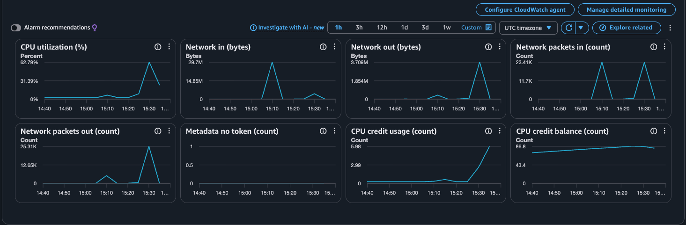

# Seat Reservation Service

A JSON HTTP API that sells assigned seats for a show and stays correct under heavy concurrency: a seat is never sold twice, a user never exceeds the per-show limit, and a retried request never books twice.

**Stack:** Java 21 · Spring Boot 3 · PostgreSQL 16 · Flyway · JdbcTemplate · Docker

| Doc | What's in it |
|-----|--------------|
| [API.md](API.md) | Every endpoint: request, response, errors |
| [DB.md](DB.md) | Tables, columns, keys, and why PostgreSQL |
| [CONCURRENCY.md](CONCURRENCY.md) | How double-sells, limits and retries are prevented |
| [ASSUMPTIONS.md](ASSUMPTIONS.md) | Scope decisions and interpretations of the brief |
| [WRITEUP.md](WRITEUP.md) | Design write-up: atomic decision, idempotency, holds, partitions, observability, AI usage |

---

## Live deployment

Running on AWS EC2 (Docker Compose: app + PostgreSQL):

| What | URL |
|------|-----|
| API base URL | `http://16.178.54.244:8080` |
| Liveness | http://16.178.54.244:8080/health/live |
| Readiness (checks the DB) | http://16.178.54.244:8080/health/ready |
| Prometheus metrics | http://16.178.54.244:8080/metrics |

```bash
./burst.sh http://16.178.54.244:8080                        # stampede against the live service
```

The Postman `staging` environment points at this instance.

**Logs:** the app writes one JSON line per request and per reserve outcome (with `request_id` and `user_id`) to stdout.

🎥 **[Screen recording of the live logs under load](https://drive.google.com/file/d/1si--0bwn53OnSSR-aHMfdDDPCkPLIxgT/view?usp=sharing)** (70 s): left, `docker compose logs -f app` on the EC2 instance streaming structured JSON (request id, user id, path, status, latency, reserve outcome); right, `./burst.sh` against the live URL (200 buyers, 5-seat hot storm, 3,345-request stampede) ending with zero 5xx and all 8 checks passing.

To follow the logs yourself on the instance:

```bash
ssh -i <key>.pem ubuntu@16.178.54.244 'cd ~/app && docker compose logs -f app'
```

**Deploying:** `./deploy.sh <HOST_IP>` builds the image locally (linux/arm64), streams it to the instance over SSH, generates secrets in `~/app/.env` on the first deploy (they never leave the server), starts the stack and waits for `/health/ready`. The instance only needs Docker.

---

## Quick start (Docker — recommended)

The only requirement is **Docker** with the Compose plugin (Docker Desktop on Mac/Windows, Docker Engine on Linux). Java, Maven and PostgreSQL are **not** needed on the machine — they run inside containers.

```bash
git clone https://github.com/SrivastavaRishi/movie-booking-system.git
cd movie-booking-system
docker compose up --build -d
```

This builds the app image, starts PostgreSQL, waits until the database is healthy, then starts the app. On startup the app creates the tables and seeds the admin user (Flyway migrations).

Check it is up:

```bash
curl http://localhost:8080/health/ready
# {"status":"UP","checks":{"db":"UP"}}
```

| Service    | Address on your machine                      |
|------------|----------------------------------------------|
| API        | `http://localhost:8080`                      |
| PostgreSQL | `localhost:5433` (db / user / password: `seatbooking`) |

### Metrics with Prometheus (optional, local)

The app always exposes Prometheus metrics at `http://localhost:8080/metrics`. To also run a Prometheus server that scrapes it every 5 s (a third container, behind an opt-in profile):

```bash
docker compose --profile monitoring up --build -d
```

Then open **http://localhost:9090** and try queries such as:

```
rate(reservations_confirmed_total[1m])
reservations_declined_total
seats{state="available"}
sum by (status) (http_server_requests_seconds_count)
```

Metric names and reconciliation rules are in [API.md](API.md#10-metrics--get-metrics).

Useful commands:

```bash
docker compose ps              # status of the containers
docker compose logs -f app     # follow the app's JSON logs
docker compose down            # stop (database data is kept)
docker compose down -v         # stop and delete the database data
```

---

## Running without Docker

Requirements: **JDK 21**, **Maven 3.9+**, **PostgreSQL 16** running on `localhost:5432`.

```bash
# one-time: create the database and user
psql -d postgres -c "CREATE ROLE seatbooking LOGIN PASSWORD 'seatbooking';"
psql -d postgres -c "CREATE DATABASE seatbooking OWNER seatbooking;"

# build and run
mvn -DskipTests package
java -jar target/app.jar
```

---

## Try it

Admin login (seeded by migration `V2`): **`admin@seatbooking.local` / `Admin@12345`**

```bash
B=http://localhost:8080
J='Content-Type: application/json'

# admin token
ADMIN=$(curl -s -XPOST $B/auth/token -H "$J" \
  -d '{"email":"admin@seatbooking.local","password":"Admin@12345"}' | python3 -c 'import sys,json;print(json.load(sys.stdin)["token"])')

# create a show (admin only)
SHOW=$(curl -s -XPOST $B/shows -H "$J" -H "Authorization: Bearer $ADMIN" \
  -d '{"name":"friday-night","seats":["A1","A2","A3"],"price_paise":25000}' | python3 -c 'import sys,json;print(json.load(sys.stdin)["id"])')

# register a user and get a token
curl -s -XPOST $B/auth/register -H "$J" -d '{"email":"alice@example.com","password":"password1"}'
USER=$(curl -s -XPOST $B/auth/token -H "$J" \
  -d '{"email":"alice@example.com","password":"password1"}' | python3 -c 'import sys,json;print(json.load(sys.stdin)["token"])')

# reserve a seat (201), retry with the same key (200, same reservation)
curl -s -XPOST $B/shows/$SHOW/reserve -H "$J" -H "Authorization: Bearer $USER" \
  -d '{"seats":["A1"],"idempotency_key":"order-1"}'

# show state (public)
curl -s $B/shows/$SHOW
```

**Postman:** import [`postman/seat-reservation.postman_collection.json`](postman/seat-reservation.postman_collection.json) plus the two environments, [`local`](postman/local.postman_environment.json) (`http://localhost:8080`) and [`staging`](postman/staging.postman_environment.json) (the deployed EC2 instance). Pick an environment in the top-right dropdown and run the collection top to bottom. Tokens and ids are saved into the selected environment automatically, so local and staging never mix tokens.

---

## Burst test (one command)

Reproduces the on-sale stampede against any running instance and prints the outcome distribution and reconciliation checks. Needs only **Python 3** (standard library).

```bash
./burst.sh http://localhost:8080
./burst.sh https://<your-deployed-url> --users 500 --requests 5000 --concurrency 100
```

What it does:

1. Creates a fresh show and registers N buyers.
2. **Hot-seat storm:** every buyer fires at the same few seats at once.
3. **Stampede:** buyers grab random seats; some retry with the same idempotency key, some reuse a key with different seats.
4. **Per-user limit:** one buyer fires 10 parallel reserves on a limit-4 show.
5. Prints the distribution (`201` / `200` replay / `409` by reason / `5xx`) and checks:
   no seat confirmed twice · exactly one winner per hot seat · zero 5xx · `available + held + confirmed == total_seats` · API counts match the 201s · per-user limit held · `/metrics` counters match the observed outcomes and the seats gauge matches the API.

Exit code is `0` only if every check passes. Options: `--users`, `--seats`, `--hot-seats`, `--requests`, `--concurrency`, `--retry-rate`, `--timeout` (see `./burst.sh <url> --help`).

On Windows, run `python scripts/burst.py <BASE_URL>` instead of `./burst.sh`.

---

## Load test results (live EC2 instance)

Instance: **AWS EC2 `t4g.small`** (2 vCPU ARM, 2 GB RAM), app + PostgreSQL in Docker Compose, default settings. Each run used `./burst.sh` and passed **all 8 checks** (no double-sell, one winner per hot seat, zero 5xx, reconciliation invariant, API counts match the 201s, per-user limit, `/metrics` counters match observed outcomes, seats gauge matches the API).

| Run | Load generated from | Reserve requests | Concurrency | Throughput | 5xx | 429 | Hot seats |
|-----|---------------------|------------------|-------------|------------|-----|-----|-----------|
| 1 | Laptop → EC2 over the internet | 500 storm + 5,549 | 200 | ~357 req/s | 0 | 0 | 5 seats, exactly 1 winner each |
| 2 | Laptop → EC2 over the internet | 1,000 storm + 22,227 | 500 | ~365 req/s | 0 | 0 | 10 seats, exactly 1 winner each |
| 3 | Inside EC2 → `localhost` (no network latency) | 300 storm + 22,211 | 400 | ~688 req/s | 0 | 0 | 10 seats, exactly 1 winner each |

```bash
# run 2
./burst.sh http://16.178.54.244:8080 --users 1000 --seats 1000 --hot-seats 10 --requests 20000 --concurrency 500 --timeout 60
```

**Observations**

- **Reserving is cheap.** During the reserve phase the app averaged ~30% of the instance's CPU, PostgreSQL peaked below 60% of one core, app memory stayed under 330 MB (limit 768 MB), and the DB connection pool never queued (`hikaricp_connections_pending = 0`). Most hot-seat losers are declined from the in-memory "already taken" set without a database round trip.
- **Runs 1–2 were limited by the client**, not the server: ~0.65 s round trip from the laptop to the instance. Run 3 removes the network and still leaves headroom (the load generator shared the same 2 vCPUs).
- **Registration/login is the expensive path.** bcrypt (cost 10) saturates both vCPUs at ~9 new users/second. Bulk user creation before a burst is slow; lowering `BCRYPT_STRENGTH` trades hashing strength for speed.
- **CPU credits.** `t4g` is a burstable instance: short bursts spend credits (the balance stayed ~87 during these runs), but sustained load would drain them and throttle the instance to its baseline.

**CloudWatch during the runs** (5-minute averages, so short peaks appear lower than the per-second figures above):



---

## Tests

Concurrency tests fire real parallel HTTP requests at the app backed by a **real PostgreSQL** (no mocks): hot-seat race, per-user limit under parallel requests, same-key retries, opposite-order multi-seat requests (deadlock check), reserves racing a show cancel, concurrent cancels, and token-vs-body identity.

They expect PostgreSQL on `localhost:5432` with a `seatbooking_test` database:

```bash
psql -d postgres -c "CREATE DATABASE seatbooking_test OWNER seatbooking;"
mvn test
```

(Override with `TEST_DB_URL`, `TEST_DB_USER`, `TEST_DB_PASSWORD`.)

---

## Configuration

All settings come from environment variables, so the same image runs locally, in Compose and on any cloud platform.

| Variable | Default | Purpose |
|----------|---------|---------|
| `PORT` | `8080` | HTTP port |
| `DB_URL` | `jdbc:postgresql://localhost:5432/seatbooking` | JDBC URL |
| `DB_USER` / `DB_PASSWORD` | `seatbooking` / `seatbooking` | DB credentials |
| `DB_POOL_SIZE` | `20` | Max DB connections |
| `DB_POOL_TIMEOUT_MS` | `3000` | Wait for a free connection before failing (→ 429) |
| `DB_LOCK_TIMEOUT` / `DB_STATEMENT_TIMEOUT` | `5s` / `10s` | PostgreSQL lock / statement timeouts (→ 429) |
| `JWT_SECRET` | dev value | HS256 signing key, **≥ 32 bytes — always set in production** |
| `JWT_TTL_SECONDS` | `3600` | Token lifetime |
| `BCRYPT_STRENGTH` | `10` | Password hashing cost |
| `RESERVE_MAX_INFLIGHT` | `20` | Reserve/cancel requests working in the DB at once |
| `RESERVE_QUEUE_TIMEOUT_MS` | `2000` | Wait for a slot before returning 429 |
| `TAKEN_CACHE_TTL_MS` | `2000` | In-memory "seat taken" cache TTL (`0` disables) |
| `TOMCAT_MAX_THREADS` / `TOMCAT_ACCEPT_COUNT` / `TOMCAT_MAX_CONNECTIONS` | `200` / `1000` / `10000` | HTTP server capacity |
| `LOG_FORMAT` | `logstash` | JSON log lines with `request_id` and `user_id` |

---

## Overload protection and rate limiting

**What exists:** global load shedding, not per-client rate limiting.

- At most `RESERVE_MAX_INFLIGHT` (default 20) reserve/cancel requests work in the database at once; others wait up to `RESERVE_QUEUE_TIMEOUT_MS` (default 2 s) for a slot, then get `429` with `Retry-After`.
- Database lock, statement and pool timeouts also return `429` instead of hanging or failing with `500`.
- `per_user_limit` caps the **seats** a user can hold per show; it does not limit request rate.

**Not implemented (next step):** per-user / per-IP request rate limiting (e.g. a token bucket keyed by user id or IP, at an API gateway or in a shared store like Redis) to stop a single aggressive client or bot from taking a large share of the shared capacity. In the live load tests the limiter never triggered (0 × `429`).

---

## Endpoints at a glance

| Method | Path | Access |
|--------|------|--------|
| POST | `/auth/register` | Public |
| POST | `/auth/token` | Public |
| POST | `/shows` | ADMIN |
| GET | `/shows/{id}` | Public |
| POST | `/shows/{id}/cancel` | ADMIN |
| POST | `/shows/{id}/reserve` | USER / ADMIN |
| POST | `/reservations/{id}/cancel` | Owner only |
| GET | `/health/live` | Public — liveness |
| GET | `/health/ready` | Public — readiness (checks the DB, `503` if down) |
| GET | `/metrics` | Public — Prometheus metrics |

Full details in [API.md](API.md).
